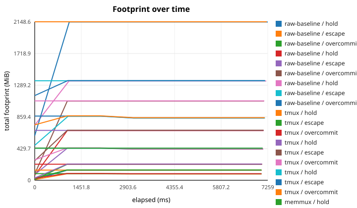
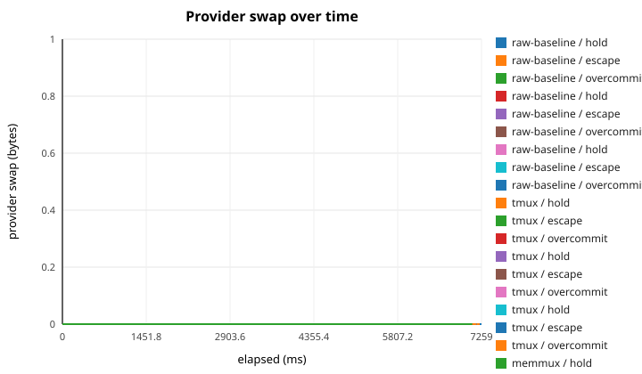
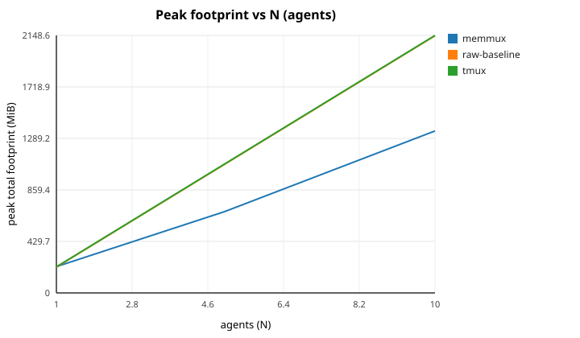

# MemMux paper benchmark (reproducer)

- **Measured (UTC):** 2026-08-25 22:56:09Z
- **Host OS:** linux
- **Host arch:** x86_64
- **Physical RAM:** 30.8 GiB
- **CPU:** Intel(R) Xeon(R) Platinum 8488C
- **Logical cores:** 8
- **memmux/bench version:** 0.8.0
- **Launcher versions:** raw-baseline = raw (direct spawn), tmux = tmux 3.4, memmux = memmux 0.8.0

_Generated by `memmux-bench`. Competitor launchers appear only when their binary was present on `PATH` and could be driven headlessly; others are listed as skipped-with-reason rather than estimated (§19.5)._

## Launchers & exclusions

_Fairness at scale (§19.5): every launcher that produced numbers is listed with its resolved version; every launcher that could not be driven on this host is listed as skipped-with-reason and never contributes a fabricated or partial number._

| Launcher | Status | Version / reason |
| --- | --- | --- |
| raw-baseline | ran | raw (direct spawn) |
| tmux | ran | tmux 3.4 |
| memmux | ran | memmux 0.8.0 |
| herdr | skipped | binary not available on this host |
| dmux | skipped | binary not available on this host |
| cmux | skipped | binary not available on this host |
| agentmux | skipped | binary not available on this host |

## Runs

_"Total footprint" is provider (agent) memory plus the multiplexer's own **manager overhead**; the two are broken out side by side. "Tree attributed" is the fraction of the launched process tree mapped back to the owning task._

_Each `mean ±halfwidth` cell is the mean over **K = 2** trial(s); ± is the 95% confidence-interval half-width (`1.96·σ/√n`, sample σ), so it is `0.0` for a single trial. "Manager CPU %" is the measured CPU utilization of the multiplexer's manager process across the run (H5); it is `n/a` when the launcher has no manager process or CPU time is unreadable on this host._

| Launcher | Version | Scenario | N | Procs | Total peak MiB | Total steady MiB | Manager overhead peak MiB | Manager overhead steady MiB | Tree attributed | Mean sample (µs) | Overhead % | Manager CPU % | Samples | Footprint |
| --- | --- | --- | ---: | ---: | ---: | ---: | ---: | ---: | ---: | ---: | ---: | ---: | ---: | --- |
| raw-baseline | raw (direct spawn) | hold | 1 | 2 | 135.3 ±0.0 | 135.3 ±0.0 | 0.0 ±0.0 | 0.0 ±0.0 | 100.0% ±0.0 | 5407 | 0.5% ±0.0 | n/a | 8 | `▁███████` |
| raw-baseline | raw (direct spawn) | escape | 1 | 3 | 87.7 ±0.0 | 84.8 ±0.0 | 0.0 ±0.0 | 0.0 ±0.0 | 100.0% ±0.0 | 4894 | 0.5% ±0.0 | n/a | 8 | `▁███████` |
| raw-baseline | raw (direct spawn) | overcommit | 1 | 2 | 215.3 ±0.0 | 215.3 ±0.0 | 0.0 ±0.0 | 0.0 ±0.0 | 100.0% ±0.0 | 6017 | 0.6% ±0.0 | n/a | 8 | `▁███████` |
| raw-baseline | raw (direct spawn) | hold | 5 | 2 | 673.7 ±0.0 | 673.7 ±0.0 | 0.0 ±0.0 | 0.0 ±0.0 | 100.0% ±0.0 | 10364 | 1.1% ±0.0 | n/a | 8 | `▁███████` |
| raw-baseline | raw (direct spawn) | escape | 5 | 3 | 434.9 ±0.0 | 422.0 ±0.0 | 0.0 ±0.0 | 0.0 ±0.0 | 100.0% ±0.0 | 8543 | 0.9% ±0.0 | n/a | 8 | `▁███████` |
| raw-baseline | raw (direct spawn) | overcommit | 5 | 2 | 1073.7 ±0.0 | 1073.7 ±0.0 | 0.0 ±0.0 | 0.0 ±0.0 | 100.0% ±0.0 | 11067 | 1.1% ±0.0 | n/a | 8 | `▁███████` |
| raw-baseline | raw (direct spawn) | hold | 10 | 2 | 1346.2 ±0.0 | 1346.2 ±0.0 | 0.0 ±0.0 | 0.0 ±0.0 | 100.0% ±0.0 | 17134 | 1.6% ±0.1 | n/a | 8 | `▁███████` |
| raw-baseline | raw (direct spawn) | escape | 10 | 3 | 868.5 ±0.0 | 843.2 ±0.0 | 0.0 ±0.0 | 0.0 ±0.0 | 100.0% ±0.0 | 13889 | 1.4% ±0.0 | n/a | 8 | `▁███████` |
| raw-baseline | raw (direct spawn) | overcommit | 10 | 2 | 2146.2 ±0.0 | 2146.2 ±0.0 | 0.0 ±0.0 | 0.0 ±0.0 | 100.0% ±0.0 | 18530 | 1.8% ±0.2 | n/a | 8 | `▁███████` |
| tmux | tmux 3.4 | hold | 1 | 2 | 137.7 ±0.1 | 137.7 ±0.1 | 2.4 ±0.0 | 2.4 ±0.0 | 100.0% ±0.0 | 5245 | 0.5% ±0.0 | 0.000% | 8 | `▁▁▁▁▁▁▁▁` |
| tmux | tmux 3.4 | escape | 1 | 3 | 90.1 ±0.0 | 87.1 ±0.0 | 2.4 ±0.0 | 2.4 ±0.0 | 100.0% ±0.0 | 5193 | 0.5% ±0.0 | 0.000% | 8 | `███▁▁▁▁▁` |
| tmux | tmux 3.4 | overcommit | 1 | 2 | 217.7 ±0.0 | 217.7 ±0.0 | 2.4 ±0.0 | 2.4 ±0.0 | 100.0% ±0.0 | 6439 | 0.6% ±0.0 | 0.000% | 8 | `▁▁▁▁▁▁▁▁` |
| tmux | tmux 3.4 | hold | 5 | 2 | 676.1 ±0.1 | 676.1 ±0.1 | 2.4 ±0.0 | 2.4 ±0.0 | 100.0% ±0.0 | 10242 | 1.0% ±0.1 | 0.000% | 8 | `▁▁▁▁▁▁▁▁` |
| tmux | tmux 3.4 | escape | 5 | 3 | 437.4 ±0.0 | 424.4 ±0.0 | 2.4 ±0.0 | 2.4 ±0.0 | 100.0% ±0.0 | 8971 | 0.9% ±0.0 | 0.000% | 8 | `███▁▁▁▁▁` |
| tmux | tmux 3.4 | overcommit | 5 | 2 | 1076.1 ±0.0 | 1076.1 ±0.0 | 2.4 ±0.0 | 2.4 ±0.0 | 100.0% ±0.0 | 11834 | 1.2% ±0.0 | 0.000% | 8 | `▁▁▁▁▁▁▁▁` |
| tmux | tmux 3.4 | hold | 10 | 2 | 1348.6 ±0.0 | 1348.6 ±0.0 | 2.4 ±0.0 | 2.4 ±0.0 | 100.0% ±0.0 | 13877 | 1.4% ±0.0 | 0.000% | 8 | `▁▁▁▁▁▁▁▁` |
| tmux | tmux 3.4 | escape | 10 | 3 | 870.9 ±0.0 | 845.6 ±0.0 | 2.4 ±0.0 | 2.4 ±0.0 | 100.0% ±0.0 | 11448 | 1.2% ±0.1 | 0.000% | 8 | `███▁▁▁▁▁` |
| tmux | tmux 3.4 | overcommit | 10 | 2 | 2148.6 ±0.0 | 2148.6 ±0.0 | 2.4 ±0.0 | 2.4 ±0.0 | 100.0% ±0.0 | 16770 | 1.7% ±0.0 | 0.000% | 8 | `▁▁▁▁▁▁▁▁` |
| memmux | memmux 0.8.0 | hold | 1 | 2 | 139.9 ±0.0 | 139.9 ±0.0 | 4.6 ±0.0 | 4.6 ±0.0 | 100.0% ±0.0 | 4689 | 0.5% ±0.0 | 0.636% | 8 | `▁███████` |
| memmux | memmux 0.8.0 | escape | 1 | 3 | 92.2 ±0.0 | 89.3 ±0.1 | 4.7 ±0.0 | 4.7 ±0.0 | 100.0% ±0.0 | 4704 | 0.5% ±0.0 | 0.566% | 8 | `▁███████` |
| memmux | memmux 0.8.0 | overcommit | 1 | 2 | 219.9 ±0.1 | 219.9 ±0.1 | 4.6 ±0.1 | 4.6 ±0.1 | 100.0% ±0.0 | 6187 | 0.6% ±0.0 | 0.635% | 8 | `▁███████` |
| memmux | memmux 0.8.0 | hold | 5 | 2 | 678.7 ±0.1 | 678.7 ±0.1 | 5.0 ±0.1 | 5.0 ±0.1 | 100.0% ±0.0 | 10004 | 1.0% ±0.0 | 1.541% | 8 | `▁███████` |
| memmux | memmux 0.8.0 | escape | 5 | 3 | 439.9 ±0.0 | 426.9 ±0.1 | 5.0 ±0.0 | 5.0 ±0.0 | 100.0% ±0.0 | 8728 | 0.9% ±0.0 | 1.333% | 8 | `▁██▇▇▇▇▇` |
| memmux | memmux 0.8.0 | overcommit | 5 | 2 | 434.8 ±0.1 | 434.8 ±0.1 | 4.8 ±0.1 | 4.8 ±0.1 | 100.0% ±0.0 | 7751 | 0.7% ±0.1 | 0.986% | 8 | `▁▇██████` |
| memmux | memmux 0.8.0 | hold | 10 | 2 | 1351.6 ±0.0 | 1351.6 ±0.0 | 5.4 ±0.0 | 5.4 ±0.0 | 100.0% ±0.0 | 13141 | 1.3% ±0.1 | 2.577% | 8 | `▁███████` |
| memmux | memmux 0.8.0 | escape | 10 | 3 | 873.9 ±0.0 | 848.6 ±0.0 | 5.4 ±0.0 | 5.4 ±0.0 | 100.0% ±0.0 | 12215 | 1.2% ±0.1 | 2.721% | 8 | `▁██▇▇▇▇▇` |
| memmux | memmux 0.8.0 | overcommit | 10 | 2 | 434.8 ±0.1 | 434.8 ±0.1 | 4.8 ±0.1 | 4.8 ±0.1 | 100.0% ±0.0 | 7844 | 0.7% ±0.2 | 0.915% | 8 | `▁▂▂▃████` |

## Cleanup on teardown (H2)

_Reclaimed % = fraction of the owned agent subtree gone within 10s of the launcher's normal teardown. `mean ±halfwidth` is over trials with cleanup data (± is the 95% CI half-width, `0.0` for a single trial)._

| Launcher | Scenario | Owned procs | Leaked procs | Leaked MiB | Reclaimed % |
| --- | --- | ---: | ---: | ---: | ---: |
| raw-baseline | hold | 2.0 ±0.0 | 1.0 ±0.0 | 30.6 ±0.0 | 50.0% ±0.0 |
| raw-baseline | escape | 1.0 ±0.0 | 0.0 ±0.0 | 0.0 ±0.0 | 100.0% ±0.0 |
| raw-baseline | overcommit | 2.0 ±0.0 | 1.0 ±0.0 | 30.6 ±0.0 | 50.0% ±0.0 |
| raw-baseline | hold | 10.0 ±0.0 | 5.0 ±0.0 | 151.8 ±0.0 | 50.0% ±0.0 |
| raw-baseline | escape | 5.0 ±0.0 | 0.0 ±0.0 | 0.0 ±0.0 | 100.0% ±0.0 |
| raw-baseline | overcommit | 10.0 ±0.0 | 5.0 ±0.0 | 151.8 ±0.0 | 50.0% ±0.0 |
| raw-baseline | hold | 20.0 ±0.0 | 10.0 ±0.0 | 303.0 ±0.0 | 50.0% ±0.0 |
| raw-baseline | escape | 10.0 ±0.0 | 0.0 ±0.0 | 0.0 ±0.0 | 100.0% ±0.0 |
| raw-baseline | overcommit | 20.0 ±0.0 | 10.0 ±0.0 | 303.0 ±0.0 | 50.0% ±0.0 |
| tmux | hold | 2.0 ±0.0 | 0.0 ±0.0 | 0.0 ±0.0 | 100.0% ±0.0 |
| tmux | escape | 1.0 ±0.0 | 0.0 ±0.0 | 0.0 ±0.0 | 100.0% ±0.0 |
| tmux | overcommit | 2.0 ±0.0 | 0.0 ±0.0 | 0.0 ±0.0 | 100.0% ±0.0 |
| tmux | hold | 10.0 ±0.0 | 0.0 ±0.0 | 0.0 ±0.0 | 100.0% ±0.0 |
| tmux | escape | 5.0 ±0.0 | 0.0 ±0.0 | 0.0 ±0.0 | 100.0% ±0.0 |
| tmux | overcommit | 10.0 ±0.0 | 0.0 ±0.0 | 0.0 ±0.0 | 100.0% ±0.0 |
| tmux | hold | 20.0 ±0.0 | 0.0 ±0.0 | 0.0 ±0.0 | 100.0% ±0.0 |
| tmux | escape | 10.0 ±0.0 | 0.0 ±0.0 | 0.0 ±0.0 | 100.0% ±0.0 |
| tmux | overcommit | 20.0 ±0.0 | 0.0 ±0.0 | 0.0 ±0.0 | 100.0% ±0.0 |
| memmux | hold | 2.0 ±0.0 | 0.0 ±0.0 | 0.0 ±0.0 | 100.0% ±0.0 |
| memmux | escape | 1.0 ±0.0 | 0.0 ±0.0 | 0.0 ±0.0 | 100.0% ±0.0 |
| memmux | overcommit | 2.0 ±0.0 | 0.0 ±0.0 | 0.0 ±0.0 | 100.0% ±0.0 |
| memmux | hold | 10.0 ±0.0 | 0.0 ±0.0 | 0.0 ±0.0 | 100.0% ±0.0 |
| memmux | escape | 5.0 ±0.0 | 0.0 ±0.0 | 0.0 ±0.0 | 100.0% ±0.0 |
| memmux | overcommit | 4.0 ±0.0 | 0.0 ±0.0 | 0.0 ±0.0 | 100.0% ±0.0 |
| memmux | hold | 20.0 ±0.0 | 0.0 ±0.0 | 0.0 ±0.0 | 100.0% ±0.0 |
| memmux | escape | 10.0 ±0.0 | 0.0 ±0.0 | 0.0 ±0.0 | 100.0% ±0.0 |
| memmux | overcommit | 4.0 ±0.0 | 0.0 ±0.0 | 0.0 ±0.0 | 100.0% ±0.0 |

## Escaped-process detection (H3)

_A process that reparents to init escapes its agent and silently leaks. MemMux's daemon surfaces it as a `process_escaped` event; tmux/herdr/raw have no such concept, so their detection is **unsupported** — an honest "n/a — no such capability", not a measured `0`. "Reparented (confirmed)" is the harness's independent check that the injected process actually left every agent subtree while still alive._

| Launcher | Injected | Reparented (confirmed) | Detected | Notes |
| --- | ---: | ---: | ---: | --- |
| raw-baseline | 1 | 1 | n/a | unsupported (no escape-detection mechanism) |
| raw-baseline | 5 | 5 | n/a | unsupported (no escape-detection mechanism) |
| raw-baseline | 10 | 10 | n/a | unsupported (no escape-detection mechanism) |
| tmux | 1 | 1 | n/a | unsupported (no escape-detection mechanism) |
| tmux | 5 | 5 | n/a | unsupported (no escape-detection mechanism) |
| tmux | 10 | 10 | n/a | unsupported (no escape-detection mechanism) |
| memmux | 1 | 1 | 1 | detected 1/1 escaped process(es) |
| memmux | 5 | 5 | 5 | detected 5/5 escaped process(es) |
| memmux | 10 | 10 | 10 | detected 10/10 escaped process(es) |

## Overcommit / bounded footprint (H4a)

_Under a **constrained agent budget** (set below the aggregate predicted peak of N agents) MemMux governs — its admission planner defers starts that would not fit and its pressure ladder reclaims resident agents — so its footprint stays near/under budget. raw/tmux/herdr are **ungoverned**: they run all N agents, so "Governance actions" is an honest "n/a — no such mechanism", not a measured `0`. "Budget MiB" applies only to MemMux (the others have no budget to enforce). Swap-growth SLO is the Linux corollary, measured on the Linux reference host via the per-process swap columns; on this host the gate is evaluated on footprint._

| Launcher | Budget MiB | Peak total MiB | Steady total MiB | Governance actions | Notes |
| --- | ---: | ---: | ---: | ---: | --- |
| raw-baseline | 3000 | 215.3 ±0.0 | 215.3 ±0.0 | n/a | none (ungoverned — no admission/pressure mechanism) |
| raw-baseline | 3000 | 1073.7 ±0.0 | 1073.7 ±0.0 | n/a | none (ungoverned — no admission/pressure mechanism) |
| raw-baseline | 3000 | 2146.2 ±0.0 | 2146.2 ±0.0 | n/a | none (ungoverned — no admission/pressure mechanism) |
| tmux | 3000 | 217.7 ±0.0 | 217.7 ±0.0 | n/a | none (ungoverned — no admission/pressure mechanism) |
| tmux | 3000 | 1076.1 ±0.0 | 1076.1 ±0.0 | n/a | none (ungoverned — no admission/pressure mechanism) |
| tmux | 3000 | 2148.6 ±0.0 | 2148.6 ±0.0 | n/a | none (ungoverned — no admission/pressure mechanism) |
| memmux | 3000 | 219.9 ±0.1 | 219.9 ±0.1 | 0 | governed: 0 deferral(s) + 0 reclamation(s) |
| memmux | 3000 | 434.8 ±0.1 | 434.8 ±0.1 | 3 | governed: 3 deferral(s) + 0 reclamation(s) |
| memmux | 3000 | 434.8 ±0.1 | 434.8 ±0.1 | 8 | governed: 8 deferral(s) + 0 reclamation(s) |

## No-lost-work (H4b)

_Before the pressure ladder terminates a victim it first captures a durable checkpoint (git HEAD + patch hash + dirty manifest). "Checkpoints captured" counts victims for which a checkpoint carrying a **non-empty** git patch hash was persisted first; "Preserved %" is captured/reclaimed. raw/tmux/herdr have no checkpoint mechanism, so this is **unsupported** — a capability comparison, NOT a fabricated "lost N files". When no victim was reclaimed this run, the metric is n/a (honest — the budget did not force a termination)._

| Launcher | Victims reclaimed | Checkpoints captured | Preserved % | Notes |
| --- | ---: | ---: | ---: | --- |
| raw-baseline | n/a | n/a | n/a | unsupported (no checkpoint mechanism) |
| raw-baseline | n/a | n/a | n/a | unsupported (no checkpoint mechanism) |
| raw-baseline | n/a | n/a | n/a | unsupported (no checkpoint mechanism) |
| tmux | n/a | n/a | n/a | unsupported (no checkpoint mechanism) |
| tmux | n/a | n/a | n/a | unsupported (no checkpoint mechanism) |
| tmux | n/a | n/a | n/a | unsupported (no checkpoint mechanism) |
| memmux | 0 | 0 | n/a | governed: no reclamation triggered this run |
| memmux | 0 | 0 | n/a | governed: no reclamation triggered this run |
| memmux | 0 | 0 | n/a | governed: no reclamation triggered this run |

## Figures

## Skipped launchers

| Launcher | Reason |
| --- | --- |
| herdr | binary not available on this host |
| dmux | binary not available on this host |
| cmux | binary not available on this host |
| agentmux | binary not available on this host |

## Launch gates (§18.5)

| Gate | Status | Detail |
| --- | --- | --- |
| Bounded memory | ⚪ skipped | no soak growth measured this run |
| Attribution | ✅ pass | min attributed 100.00% vs >= 95% |
| Sampling overhead | ❌ fail | overhead 2.721% vs <= 2% |
| Cleanup | ✅ pass | min reclaimed 100.00% vs >= 99.5% |
| No lost work | ⚪ skipped | no pressure reclamation triggered this run (no victim to preserve) |
| Pressure avoidance | ✅ pass | steady footprint 219.9 MiB vs <= 3300.0 MiB (budget 3000.0 MiB × 1.10) |
| Resume | ⚪ skipped | checkpoint / native resume arrives in Phase 2 |
